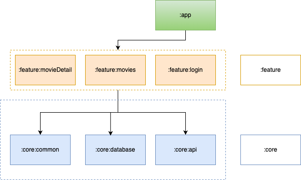

# MovieNight

Movie Night is a Android appthat shows Lists of movies, Tv Shows and details of each movie and tv show with the help of TMDB (The Movie DataBase) API. Users can explore detailed descriptions, watch trailers, and get insights into the latest films in theaters. The app also provides information about upcoming movies, allowing users to stay updated on what's coming next. Whether you're looking for release dates, movie details, or trailers, Movie Night makes it simple to keep track of your favorite films.

## Download

<a href="https://play.google.com/store/apps/details?id=com.cdcoding.movienightapp" target="_blank">

</a>

## ▶ Demos

https://github.com/user-attachments/assets/05d81cc5-f037-48ff-bf3a-252443f3afd7

## Screenshots

<table>
  <td>
    <p align="center">
      
    </p>
  </td>
    <td>
    <p align="center">
      
    </p>
  </td>
    <td>
    <p align="center">
      
    </p>
  </td>
</tr>
</table>

## Setup

In order to run this application, you need to get your own key from TMDb. You can do that by clicking [here](https://www.themoviedb.org/account/signup).

After you get an API key, put that key in ```gradle.properties``` file as follows:
```
RELEASE_API_KEY=your_key_api
DEBUG_API_KEY=your_key_api
```

## Project Setup & Environment

#### Requirements
- Java 17
- You require the latest [Android Studio](https://developer.android.com/studio/preview) release to be able to build the app.


## Architecture
The project implements on MVVM design pattern by following the clean architecture principles. The project separated into three main layers:
- Data
- Presentation
- Domain

### 🔸 Data
Data layer contains application data that are fetched from either the network source or the local database.

Consists of four packages:
- `local` contains *Room* components to fetch data from the local database
- `mapper` contains mapping functions to map DTOs(Data Transfer Objects) and database entities to domain models
- `remote` contains *Retrofit* components to fetch data from the network source
- `repository` contains **implementations** of repository interfaces that are defined in the domain layer

### 🔸 Presentation
Presentation layer is responsible for displaying application data on the screen. It contains  UI elements that render the data on the screen and ViewModel classes that store and manage data in a lifecycle-conscious way.

### 🔸 Domain
Domain layer is the central layer of the project. This layer is a bridge between the data layer and the presentation layer-it retrieves data from the data layer and exposes it to the presentation layer. This layer is independent of other layers-any changes in other layers don't affect this layer.

Consists of three packages:
- `model` contains data classes that hold the data retrieved from the data layer to be used later on in the presentation layer to expose it to UI
- `repository` contains repository **interfaces** to abstract the domain layer from the data layer
- `usecase` contains use cases(interactors) that handle the business logic, which are reused by multiple ViewModels

## 📚 Libraries
- [Jetpack](https://developer.android.com/jetpack) libraries
  - [Lifecycle](https://developer.android.com/topic/libraries/architecture/lifecycle) - Handling lifecycles with lifecycle-aware component
  - [ViewModel](https://developer.android.com/topic/libraries/architecture/viewmodel) - Storing and managing UI-related data in a lifecycle-conscious way
  - [Hilt](https://developer.android.com/training/dependency-injection/hilt-android) - Injecting dependencies
  - [Room](https://developer.android.com/training/data-storage/room) - Constructing SQLite database more easily
  - [DataStore](https://developer.android.com/topic/libraries/architecture/datastore) - Persisting the key-value pairs or typed objects with protocol buffers
  - [Worker](https://developer.android.com/jetpack/androidx/releases/work) - Sync data
- [Kotlin Coroutines](https://kotlinlang.org/docs/coroutines-overview.html) - Allowing asynchronous programming with Kotlin
- [Retrofit](https://github.com/square/retrofit) - Interacting with the REST API
- [OkHttp](https://github.com/square/okhttp) - Implementing interceptors
- [Gson](https://github.com/google/gson) - Converting JSON to Kotlin data class
- [coil](https://github.com/coil-kt/coil) - Loading and caching images
- [YouTube Android Player](https://developers.google.com/youtube/android/player) - Playing YouTube video in app
  
## Modularization
This app has been fully modularized and you can find the detailed guidance and description of the modularization strategy.





## Contact with me

💬  If you have any question / feedback, please do not hesitate to reach out to me in linkedin:

[](https://www.linkedin.com/in/christophe-da-costa-72225553/)

